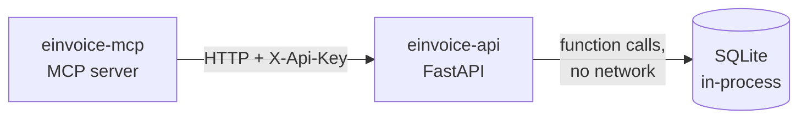

<h1 align="center">E-Invoice Access Point API</h1>

<p align="center">
  
  
  
</p>

<p align="center">
  <em>A stand-in for an InvoiceNow (Peppol) SMP Access Point — the business API
  that <a href="https://github.com/LouisAnhTran/plexus-einvoice-mcp">plexus-einvoice-mcp</a> wraps.</em>
</p>

---

## Why this exists

An MCP server should call a business API, not reach into someone else's
database. This service is that API: it owns the data, enforces the auth, and
runs the state machine, so the MCP server can be a thin, credential-light
translation layer.

It models the parts of Singapore's InvoiceNow (Peppol) Access Point API that
make interesting agent tools — registering a company, watching its onboarding
statuses settle, and toggling tax submission — without any of the real
network's certificates, KYC uploads, or CorpPass flows.

> [!NOTE]
> **This is a dummy.** It validates nothing meaningful, talks to no external
> network, and will happily register `iso6523-actorid-upis::0195:NOT-A-REAL-UEN`.
> Its job is to behave *plausibly* so the agent above it has something real to
> reason about.

## Architecture



**One process, one port, no database server.** SQLite is a library linked into
the app — there is no daemon, no connection string, and nothing to host. The
default `:memory:` keeps everything in RAM and wipes it on shutdown.

## The data model

One table. Two independent state machines on the same row.

| Column | Notes |
|---|---|
| `participant_id` | `iso6523-actorid-upis::0195:202400100A`, unique |
| `uen` | `202400100A` — parsed out on write so lookups can use the bare number |
| `name`, `country_code`, `solution_provider_id` | |
| `access_point_configurations` | JSON, stored as text |
| `kyc_status`, `kyc_status_changed_at` | always configured |
| `tax_status`, `tax_status_changed_at` | `NULL` until enabled |
| `created_at`, `updated_at` | ISO-8601 UTC text |

### Statuses

```
register  ──►  kycStatus: PENDING ──30s──► REGISTERED

taxSubmissionEnabled: true    ─┐
POST .../tax/activate         ─┴► taxStatus: PENDING_ACTIVATION ──30s──► ACTIVATED

POST .../tax/deactivate        ──► taxStatus: PENDING_DEACTIVATION ──30s──► DEACTIVATED
```

`taxStatus` is `null` when tax submission was never enabled. The two tracks run
on separate clocks and are fully independent — tax can be activated while KYC
is still `PENDING`.

### No scheduler

Status is **projected on read**, not advanced by a background worker. Each read
compares `*_status_changed_at` against the wall clock, applies as many
transitions as the elapsed time allows, and persists the result.

That means a company registered an hour ago reads as `REGISTERED` the first
time anyone looks, timestamps stay accurate across restarts, and there is no
worker to fall out of sync with the request path. See
[`services/state.py`](services/state.py).

Responses include `kycSecondsUntilNextChange` / `taxSecondsUntilNextChange`
(`null` when settled) so a caller can say *"about 4 more minutes"* instead of
polling blind.

## Quickstart

Requires Python 3.11+ and [`uv`](https://docs.astral.sh/uv/). No database to install.

```bash
git clone https://github.com/LouisAnhTran/plexus-einvoice-api.git
cd plexus-einvoice-api
cp .env.example .env
uv sync
.venv/bin/uvicorn main:app --port 8100
```

```bash
curl localhost:8100/health
# {"status":"ok","db":true,"storage":":memory:","autoAdvanceSeconds":30}
```

Interactive docs: **http://localhost:8100/docs**

> [!TIP]
> Set `EINVOICE_AUTO_ADVANCE_SECONDS=5` while developing so you aren't waiting
> 30 seconds on every state transition.

## API

Every endpoint except `/health` requires the `X-Api-Key` header.

| Method | Path | Description |
|---|---|---|
| `GET` | `/health` | liveness, storage mode, configured delay — **no auth** |
| `POST` | `/ap/v1/participant` | register a company |
| `GET` | `/ap/v1/participant` | list all companies |
| `GET` | `/ap/v1/participant/{id}` | get one — accepts participantId **or** bare UEN |
| `DELETE` | `/ap/v1/participant/{id}` | deregister (204) — **requires tax submission off** |
| `POST` | `/ap/v1/participants/{id}/tax/activate` | begin tax activation |
| `POST` | `/ap/v1/participants/{id}/tax/deactivate` | begin tax deactivation |

<details>
<summary><strong>Register a company</strong></summary>

```bash
curl -X POST localhost:8100/ap/v1/participant \
  -H 'X-Api-Key: dev-smp-key' \
  -H 'Content-Type: application/json' \
  -d '{
    "participantId": "iso6523-actorid-upis::0195:202400100A",
    "name": "Staple Test Pte Ltd",
    "countryCode": "SG",
    "taxSubmissionEnabled": true
  }'
```

```json
{
  "participantId": "iso6523-actorid-upis::0195:202400100A",
  "uen": "202400100A",
  "name": "Staple Test Pte Ltd",
  "countryCode": "SG",
  "kycStatus": "PENDING",
  "kycSecondsUntilNextChange": 29,
  "taxStatus": "PENDING_ACTIVATION",
  "taxSecondsUntilNextChange": 29,
  "createdAt": "2026-08-01T10:12:04.672825+00:00"
}
```

`taxSubmissionEnabled` is optional and defaults to `false`, leaving `taxStatus`
null — tax can still be activated later.

</details>

### Status codes

| Code | When |
|---|---|
| `401` | missing or wrong `X-Api-Key` |
| `404` | no company with that participantId or UEN |
| `409` | already registered · tax already `ACTIVATED`/`PENDING_ACTIVATION` · deactivating something never enabled · **deregistering while tax submission is on** |

### Wind-down order

A company still submitting tax documents cannot be deleted out from under its
tax registration — deleting would strip it from the network while the tax
authority still believes it is filing. `DELETE` is therefore refused unless
`taxStatus` is `null` or `DEACTIVATED`:

```
taxStatus = null                  ──► DELETE allowed (never enabled)
taxStatus = PENDING_ACTIVATION    ──► 409  deactivate first
taxStatus = ACTIVATED             ──► 409  deactivate first
taxStatus = PENDING_DEACTIVATION  ──► 409  wait (~N seconds, reported in the error)
taxStatus = DEACTIVATED           ──► DELETE allowed
```

The correct sequence is **deactivate → wait for `DEACTIVATED` → deregister**.
Deactivation is not instant, so the `PENDING_DEACTIVATION` error includes the
seconds remaining rather than just refusing.
| `422` | request body failed validation |

## Configuration

Every setting is read from the environment with the `EINVOICE_` prefix. Real
environment variables override `.env`, so a container platform can inject them
and ship no file at all.

| Variable | Default | Notes |
|---|---|---|
| `EINVOICE_DATABASE_PATH` | `:memory:` | `:memory:`, or a path like `/data/einvoice.db` to persist |
| `EINVOICE_API_KEY` | `dev-smp-key` | shared secret; the MCP server must send the same value |
| `EINVOICE_AUTO_ADVANCE_SECONDS` | `30` | seconds in each pending state |

> [!WARNING]
> `EINVOICE_API_KEY` has a default, so a deployment that forgets to set it comes
> up with the key that is printed in this repo's `.env.example`. Set it
> explicitly anywhere reachable.

## Deploying

One container, no database service:

```bash
docker run -p 8100:8100 \
  -e EINVOICE_API_KEY=<real-secret> \
  -e EINVOICE_DATABASE_PATH=:memory: \
  einvoice-api
```

Use `EINVOICE_DATABASE_PATH=/data/einvoice.db` with a mounted volume if you want
registrations to survive a restart.

⚠️ **Do not scale past one replica.** Each process owns its own SQLite database,
so two replicas mean two divergent datasets serving the same clients. This is a
demo service; if you need real horizontal scaling, that's the point at which it
should be a real database.

## Layout

```
main.py                 FastAPI app, lifespan, router wiring
config.py               pydantic-settings, EINVOICE_ prefix
db.py                   aiosqlite connection, schema, timestamp/JSON helpers
models.py               request/response models
routers/
  companies.py          the /ap/v1 endpoints
  deps.py               X-Api-Key dependency
  health.py             unauthenticated probe
services/
  companies.py          reads/writes, projection on every read
  state.py              the two state machines and the time projection
```

### Two implementation notes

**One SQLite connection, held for the process lifetime, writes behind a lock.**
Not just simplicity — every new connection to `:memory:` gets its *own empty
database*, so a normal connection pool would hand out connections that cannot
see each other's writes and data would appear to vanish at random.

**Timestamps are ISO-8601 text.** SQLite has no native date type. `db.py`
converts on the way in and out, and treats any naive value as UTC so the
projection never compares an aware datetime against a naive one.

---

<p align="center"><sub>Part of <strong>Plexus</strong> · paired with <a href="https://github.com/LouisAnhTran/plexus-einvoice-mcp">plexus-einvoice-mcp</a></sub></p>
